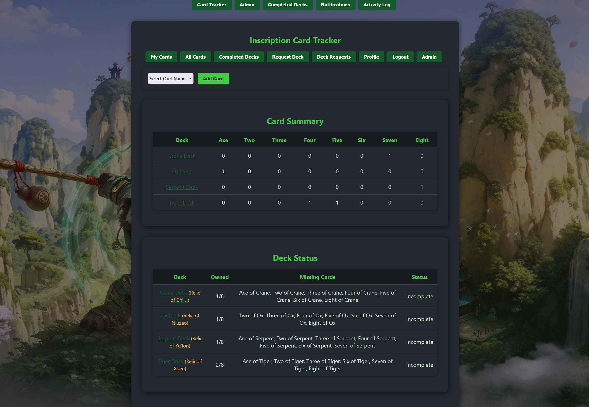

# Mist of Pandaria Card Tracker

## Screenshots

### Homepage


**Version: 1.0.4**

A self-hosted web app for World of Warcraft: Mist of Pandaria - Classic guilds to track Inscription Cards, complete decks, manage deck sales, payouts, and more. Built for transparency, sharing, and easy guild management.

## Major Features

- **Card & Deck Tracking:** Track all MoP Inscription cards, deck completion status, and contributors
- **User Management:** Registration, approval, roles (Admin, Officer, User), and profile management
- **Notification System:** Unified system for in-app, Discord webhook, and per-user Gotify notifications
- **Admin Panel:** User approval, deck allocation, analytics, export/import, notification config
- **Activity Logging:** Transparent logging of all major actions
- **Analytics:** Contributor leaderboard, deck fulfillment speed, card acquisition trends
- **Export/Import:** CSV-based data portability for cards and decks (admin only)
- **Responsive UI:** Mobile-friendly, MoP-themed interface

For detailed changes and bug fixes, please refer to the [CHANGELOG.md](CHANGELOG.md) file.

## Release Notes: Version 1.0.4 (2025-07-27)

### Major Improvements
- Fixed announcement modal styling to match the site's dark theme with MoP green accents
- Added persistent dismissal of announcements using localStorage to prevent reappearing after navigation
- Improved error handling and debugging for the announcement system
- Removed database files from git tracking to prevent overwriting production databases during updates
- Added database initialization script for new installations

## Previous Major Release: Version 1.0.0 (2025-07-26)

### Major Features & Improvements
- Initial stable release of MoP Inscription Deck Tracker
- Complete card and deck tracking functionality
- Fully functional user authentication with JWT
- Admin panel with comprehensive user management
- Discord webhook integration for notifications
- Gotify notification support for personalized alerts

## Features
- Track all Mist of Pandaria Inscription Cards
- Grid and summary views for cards and decks
- Wowhead tooltips for trinkets in Deck Status
- Mobile-friendly, responsive design
- Dark mode and MoP-themed visuals
- Add/remove cards and owners
- SQLite database for persistent storage
- React frontend, Express backend
- Easy deployment and auto-start script
- Admin panel for user approval, deck allocation, and role management
- Completed Decks page with disposition, sale price, and payout information
- Admin Announcement Modal for important guild communications
- Notifications for approvals, deck completions, payouts, and more
- User Profile with personal cards, completed decks, and notification settings
- Discord Integration for automated guild notifications
- Gotify Notifications for personalized alerts

## Tech Stack
- Node.js + Express.js (backend)
- React (frontend)
- SQLite (database)
- Chart.js (analytics)

## Setup & Installation
1. **Clone the repository:**
   ```bash
<<<<<<< HEAD
   git clone https://github.com/yourusername/mop-inscription-deck-tracker.git
   cd mop-inscription-deck-tracker
=======
   git clone https://github.com/Paccoco/MoP-Inscription-Deck-Tracker.git
   cd MoP-Inscription-Deck-Tracker
>>>>>>> master
   ```
2. **Initialize the database:**
   ```bash
   ./init-database.sh
   ```
   This will create the necessary database schema for the application.

3. **Install dependencies:**
   ```bash
   npm install
   cd client && npm install
   ```
4. **Build the React frontend:**
   ```bash
   cd client && npm run build
   ```
5. **Create an admin user:**
   ```bash
   node update-admin-password.js
   ```
   Follow the prompts to set up the admin account.

6. **Start the backend server:**
   ```bash
<<<<<<< HEAD
   node server-auth.js
   ```
   Or use the provided startup script:
   ```bash
=======
>>>>>>> master
   ./start-card-tracker.sh
   ```
7. **Access the app:**
   Open your browser and go to `http://localhost:5000` (or your server's IP/domain).

## Discord & Gotify Integration
- Configure Discord webhook and Gotify server/token in the Admin Panel.
- Each user can configure their own Gotify server and token in their profile, and select which notification types they want to receive.
- Automated notifications for deck completions, sales, requests, admin approvals, and new user registrations (admin only).

## How To Use
### For All Users
- **Register:** Create an account and wait for admin approval
- **Login:** Access your account once approved
- **Track Cards:** Add/remove cards you own on the Card Tracker page
- **View Deck Progress:** See grid/summary views and Wowhead trinket tooltips. Completed decks are highlighted
- **Completed Decks:** View all completed decks, their disposition, sale price, payout split, and estimated value
- **Notifications:** View in-app notifications for approvals, deck completions, payouts, requests, and (for admins) new user registrations
- **Deck Requests:** Request specific decks and track their fulfillment status
- **Activity Log:** View recent actions (card added/removed, deck completed/sold) for transparency
- **Profile:** View your cards, completed decks, payouts, recent activity, and configure Gotify notifications
- **Analytics:** View charts for deck completion rates, contributor stats, and payout trends
- **Card/Deck History:** View timeline/history for each card and deck

### For Admins/Officers
- **Approve Users:** Review and approve new registrations (receive notification for new user needing approval)
- **Allocate Completed Decks:** Select from completed/unallocated decks and view estimated deck value
- **Notifications:** Users are notified automatically for approvals, deck completions, payouts, requests, and new user registrations
- **Export/Import:** Export/import all card/deck data to CSV (**admin panel only**)
- **Activity Log:** View recent actions for all users for transparency
- **Role Management:** Assign roles (Admin, Officer, User)
- **Analytics:** View deck completion rates, contributor stats, and payout history
- **Discord & Gotify Integration:** Configure Discord webhook for automated notifications, and set up Gotify for guild-wide or personal notifications
- **User Removal:** Remove user access directly from the Admin panel

## API Endpoints
- `/api/cards` - Get/add/delete cards
- `/api/completed-decks` - Get/add completed decks
- `/api/admin/completed-unallocated-decks` - Get completed decks not yet allocated
- `/api/admin/approve` - Approve users
- `/api/notifications` - Get notifications for logged-in user
- `/api/notifications/read` - Mark notification as read
- `/api/deck-requests` - Get/add deck requests
- `/api/export/cards` - Export all cards as CSV (**admin only**)
- `/api/export/decks` - Export all completed decks as CSV (**admin only**)
- `/api/activity` - Get recent activity log
- `/api/activity/all` - Get recent activity log for all users (**admin only**)
- `/api/profile` - Get user profile info
- `/api/gotify/config` - Configure Gotify server/token and notification types (per user)
- `/api/analytics` - Get analytics dashboard data
- `/api/cards/:id/history` - Get card history
- `/api/decks/:id/history` - Get deck history
- `/api/discord/webhook` - Configure Discord webhook for notifications

## Automated Dependency Updates
This repository uses **Dependabot** for automated dependency updates:
- Weekly checks for outdated or vulnerable dependencies
- Automated pull requests for updates
- CI runs security and test checks before merging

## Troubleshooting
- If notifications are not received, check your Gotify/Discord config and ensure your server is running.
- For mobile issues, ensure your browser is up to date and try resizing the window.
- For export/import problems, verify CSV format and file encoding.
- For login issues, check browser console and server logs for more details.
